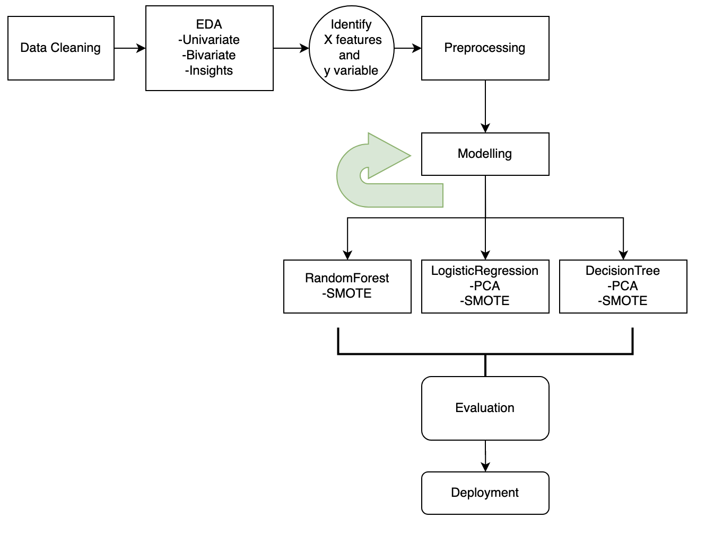

## Can we predict Heart Disease?
=========================

### Project Overview

Can we predict whether patients suffered from heart disease using other variables?

Patients of all ages and sex can suffer from heart disease. With this project, I want to see if there are underlying conditions that can increase a patient's chance of suffering from heart disease.

We can use machine learning to see underlying causes of Heart disease, whether some patients are more likely and why. If we can see links between certain attributes, lifestyle choices and heart disease, we can inform the general population on how to lessen their heart disease chances.

I will treat the 'HadAngina' column as my target variable for my classification problem. I will try different models to see what features are useful to predict whether a patient is at risk of heart disease. 

### Walkthrough Demo

...
...
...

### Project Flowchart

### Project Organization

...
...
...

* `data` 
    - Link to dataset used: 
    https://drive.google.com/drive/folders/1_hFiY3zGFq9IBhDHapgpwVWBfYq4bYRI?usp=drive_link 

* `model`
    - joblib dump of final model / model object

* `notebooks`
    - Contains all final notebooks involved in the project

* `Presentations`
    - Contains all presentations as pdf files

* `src`
    - Contains the project source code (refactored from the notebooks)

* `.gitignore`
    - Part of Git, includes files and folders to be ignored by Git version control

* `capstine_env.yml`
    - Conda environment specification

* `README.md`
    - Project landing page (this page)

* `LICENSE`
    - Project license

### Dataset

... Original Data is hosted on Kaggle by Kamil Pytlak

... https://www.kaggle.com/datasets/kamilpytlak/personal-key-indicators-of-heart-disease/data 

### Credits & References

 Brainstation Data Science Notebooks

--------